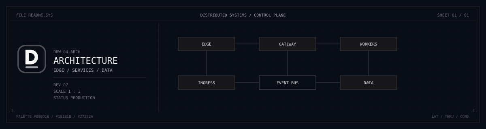

  <picture>
    <source media="(prefers-color-scheme: dark)" srcset="./assets/banner-dark.svg" />
    <source media="(prefers-color-scheme: light)" srcset="./assets/banner-light.svg" />
    
  </picture>

<h1 align="center">Danial Bakhtiari</h1>

<strong>Full-Stack Developer</strong>

  I build deterministic web platforms — SSR/SSG surfaces, island architectures, and micro-frontends whose behavior stays explicit as they scale. The same contract extends to high-throughput backends: typed APIs, event-driven boundaries, and failure modes designed in rather than discovered in production.

  <code>Status</code>&nbsp;Open for Consulting
  &nbsp;&nbsp;&#183;&nbsp;&nbsp;
  <code>Domain</code>&nbsp;<a href="https://danialbakhtiari.com">danialbakhtiari.com</a>

## Philosophy

**High-Performance Web &amp; Architecture** 
SSR/SSG and island architectures as the default rendering model. Core Web Vitals treated as design constraints, not a post-ship audit.

**Scalable Backend Systems** 
Event-driven services, REST and GraphQL at explicit bounded contexts, type-safe API contracts, and caching layers that make load a planned property of the system.

**Developer Tooling &amp; DevOps** 
Containerized runtimes, CI/CD that refuses unverified work, and linting/typing automation that makes the correct path the shortest path.

## Stack

  <strong>Frontend Systems</strong> 
  
  
  
  
  
  

  <strong>Backend &amp; API</strong> 
  
  
  
  
  
  

  <strong>Persistence &amp; Caching</strong> 
  
  
  
  
  

  <strong>Infrastructure &amp; Workflows</strong> 
  
  
  
  
  
  

## Metrics

  

## Writing

<!-- BLOG-POST-LIST:START -->
<!-- BLOG-POST-LIST:END -->

  <a href="https://github.com/DanialBakhtiari"><code>github</code></a>
  &nbsp;&#183;&nbsp;
  <a href="https://danialbakhtiari.com"><code>web</code></a>
  &nbsp;&#183;&nbsp;
  <a href="mailto:me@danialbakhtiari.com"><code>email</code></a>

  &#169; Danial Bakhtiari

